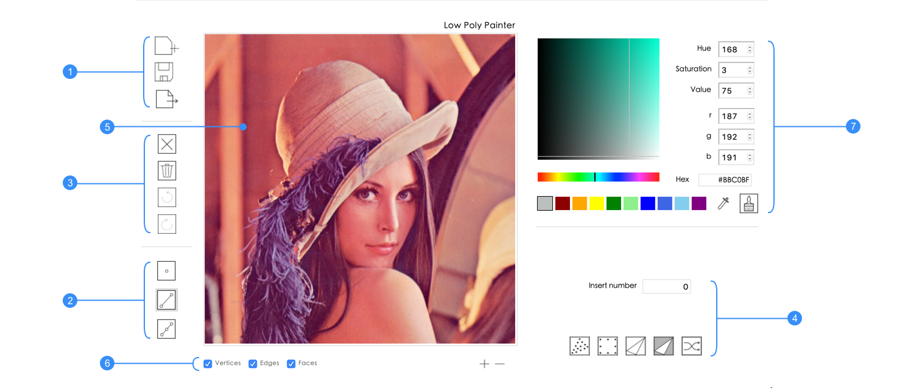
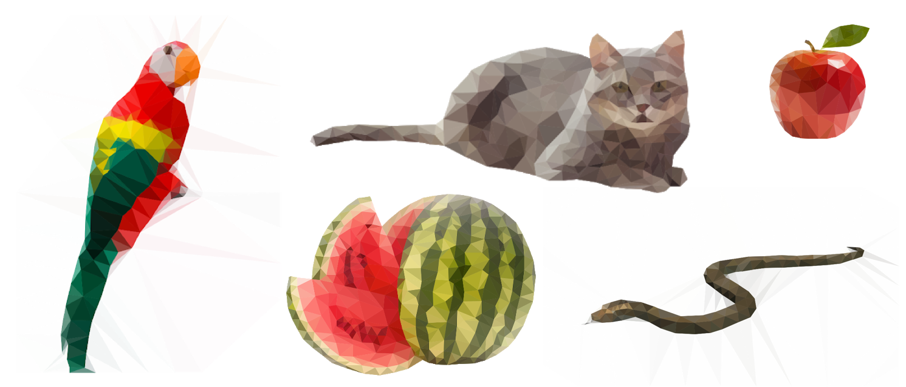
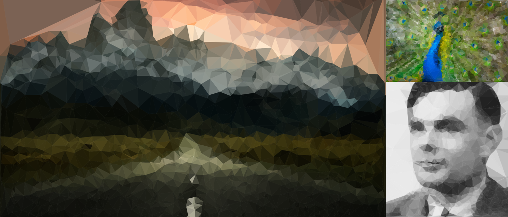

# Low Poly Painter

> Application designed for easy creation of low poly art.

[![Phyton][python-image]][python-url]
[![Dependencies][dependencies-image]][dependencies-url]

 Graphical application to load images and export or save low poly art. Draw or automate
 2D mesh creation with point, edge, face and triangulation tools. For further
 detail take a look at [usage](https://github.com/cgtuebingen/low-poly-painter#usage). For more examples take a look at [gallery](https://github.com/cgtuebingen/low-poly-painter#gallery).

<p align="center">
  
</p>


## Requirements
* **Python 2.7**
* **Python packages**\
Scipy, Numpy, Pillow, Enum34, OpenCV, Tkinter, SVGwrite, Bresenham, Scikit-image, Tkcolorpicker


## Install
1. Install dependencies\
```pip install scipy scikit-image numpy pillow enum34 opencv-python tkinter svgwrite bresenham tkcolorpicker```
2. Clone repository\
```git clone https://github.com/cgtuebingen/low-poly-painter.git```
3. Run program\
```python lowpolypainter.py lenna.jpg```


## Usage


#### 1. Import / Save / Export
* Import new images with the first button
* Save progress with the first second button to continue later 
* Export with the third button to produce low poly art file (.svg)

#### 2. Mesh / Point / Line / Face
Add points by clicking on the canvas (5). Add edges by connecting points (intersecting lines will be marked). Add faces by connecting three points with three edges. Faces will be colored according to the background mean. Selected points edges and faces will be marked red. Selected points can be moved by dragging, edges and faces will move with the point. If a point is dropped on another point, it will merge with the point and all its edges. Edges can be split with another point. Merging and splitting edges may resolve in breaking existing faces.
* Create points by selecting the first button and clicking on the mesh 
* Create points and edges by selecting the second button and clicking on the mesh
* Create points on existing edges by selecting the third button and clicking on the mesh

#### 3. Clear / Delete / Undo / Redo
* Clear the entire canvas with the first button
* Delete the selected point, edge or face with the second button (keyboard: backspace or delete)
* Undo every action with the third button
* Redo every action with the fourth button

#### 4. Triangulation / Border
It is possible to automaticly create points, edges and faces (triangulate). If the entry field is zero, only existing points will be triangulated. If the entry field is greater then zero, new points will be added and triangulated. With the mask feature, the canvas changes, you can select an area that should be triangulated. Border will either create a number of points on the edge of the canvas or will fill in remaining space according to the convex hull of the mesh.
* Toggle mask canvas with the first button
* Create a number(-) of points, with the second button.
* Triangulate all points, masked points and / or newly created number(-) of points with the third button
* Fill the remaining space with the fourth button (point count must be greater than 4)
* Create a number(-) of random points with the fifth button\
The content of entry will determine the number(-)

#### 5. Canvas Zoom
* Scrolling in the canvas with mousewheel up or (+) at the bottom right
* Scrolling out the canvas with mousewheel up or (-) at the bottom right

#### 6. Visibility
* Points / Verts visibility can be toggled by the first checkbox
* Edges visibility can be toggled by the second checkbox
* Faces visibility can be toggled by the third checkbox

#### 7. Color
Face color can be changed by selecting a color from the ten given slots. The slots color can be changed by manualy selecting or typing in the color value. 
* Extract the color of the image with the pipette button
* Fill color of faces with the brush button

## Gallery



## Meta
Jan Huber - [Jan-Huber](https://github.com/Jan-Huber) \
Anton Maidl - [aMaidl](https://github.com/aMaidl)\
Felix Scholl - [FelixFifi](https://github.com/FelixFifi)\
Timo Mohrlok - [NudelGamesDE](https://github.com/NudelGamesDE)\
Sarah Tartaruga - [sarahtartaruga](https://github.com/sarahtartaruga)\
Jan-Niklas Dihmann – [JDihlmann](https://github.com/JDihlmann)\
Marianna Glanovitis - [MariannaGla](https://github.com/MariannaGla)


## Contributing

Feel free to fork and create branches. This is an non comercial students project.\
We can't guarantee for any functionality thus wont take resposibility.


<!-- Markdown link & img dfn's -->
[python-image]: https://img.shields.io/badge/Python-2.7-blue.svg?style=flat-square
[python-url]: https://www.anaconda.com/download/
[dependencies-image]: https://img.shields.io/depfu/depfu/example-ruby.svg?style=flat-square
[dependencies-url]: https://github.com/cgtuebingen/low-poly-painter#requirements
